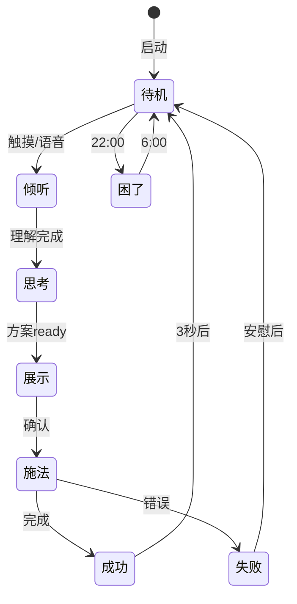

# 小忍AI - UI/UX设计文档

## 极简交互界面规范 v2.0

------

## 1. 核心设计理念

**一切围绕小忍**：界面即小忍，小忍即界面。

```
设计原则：
- 小忍占据视觉中心（60%+屏幕空间）
- 功能通过小忍的动作触发
- 按钮最小化，手势最大化
- 对话驱动，而非菜单驱动
```

------

## 2. 主界面

### 2.1 默认状态

```
┌─────────────────────────┐
│                         │
│                         │
│         🥷              │ ← 小忍待机动画
│                         │   idle_animation()
│      轻触我聊天          │
│                         │
│ ●───────────────────○   │ ← 能量条(极简)
│ 2                       │   energy_bar.value
└─────────────────────────┘
```

**核心代码连接**：

```javascript
// 小忍待机动画触发认知扫描
xiaoren.on('idle', () => {
  background_scan = cognitive_core.passive_scan(environment);
  if (background_scan.has_optimizable) {
    xiaoren.play('notice_animation');
  }
});
```

### 2.2 小忍被触摸时

```
┌─────────────────────────┐
│                         │
│    ✨ 🥷 ✨            │ ← 开心动画
│                         │   happy_bounce()
│   "有什么想改变的吗?"    │
│                         │
│ [🎤]              [📷] │ ← 仅两个核心按钮
└─────────────────────────┘
```

**触摸响应机制**：

```javascript
xiaoren.on('touch', (location) => {
  // 不同部位触摸触发不同反应
  if (location === 'head') {
    xiaoren.play('shy_animation');
    hint = "摸头会害羞的啦~";
  } else {
    xiaoren.play('ready_animation');
    cognitive_core.start_listening();
  }
});
```

------

## 3. 对话界面

### 3.1 用户说话时

```
┌─────────────────────────┐
│                         │
│      👂 🥷              │ ← 倾听动画
│         ·∙∘∘∙·         │   listening_wave()
│                         │
│  "天花板的灯好刺眼..."   │ ← 实时语音转文字
│                         │
└─────────────────────────┘
```

**语音处理连接**：

```javascript
speech.on('partial_result', (text) => {
  // 实时分析用户意图
  intent = cognitive_core.analyze_intent(text);
  xiaoren.expression = map_intent_to_emotion(intent);
});
```

### 3.2 小忍思考时

```
┌─────────────────────────┐
│                         │
│      🤔 🥷              │ ← 思考动画
│    ○ · · · ○           │   thinking_dots()
│                         │
│   正在分析可能性...      │
│                         │
└─────────────────────────┘
```

**后台分析过程**：

```javascript
// 小忍思考时的核心计算
async function analyze_possibility() {
  const scan = await cognitive_core.deep_scan(target);
  const plasticity = scan.get_plasticity_matrix();
  
  // 根据可塑性决定小忍表情
  if (plasticity.max() > 0.8) {
    xiaoren.expression = 'confident';
  } else if (plasticity.max() > 0.3) {
    xiaoren.expression = 'hopeful';  
  } else {
    xiaoren.expression = 'worried';
  }
}
```

### 3.3 方案展示

```
┌─────────────────────────┐
│     改造前 → 改造后      │
│   💡 ———→ 🌟           │ ← 可视化预览
│                         │   preview_animation()
│      😊 🥷              │
│                         │
│ "变成柔和的星光,2点"     │
│                         │
│    [开始✨]             │ ← 单一确认按钮
└─────────────────────────┘
```

**预览生成**：

```javascript
function generate_preview(current_state, target_state) {
  // 生成渐变动画
  preview = animate.morph(
    current_state.visual,
    target_state.visual,
    duration: 2000,
    easing: 'ease-in-out'
  );
  
  // 计算能量消耗
  cost = cognitive_core.calculate_energy(
    current_state,
    target_state
  );
  
  return { preview, cost };
}
```

------

## 4. 改造过程界面

### 4.1 施展忍术

```
┌─────────────────────────┐
│                         │
│    ✋ 🥷 ✋             │ ← 施法动画
│   ╱  ╱  ╱             │   casting_jutsu()
│  ╱  ╱  ╱              │
│                         │
│  ████████░░ 80%        │ ← 极简进度条
│                         │
└─────────────────────────┘
```

**核心改造触发**：

```javascript
// 小忍施法动作对应的量子操作
function perform_jutsu(stage) {
  switch(stage) {
    case 'awareness':
      quantum_field.modulate(awareness_params);
      xiaoren.play('hand_seal_1');
      break;
    case 'causal':
      quantum_field.restructure(causal_params);
      xiaoren.play('hand_seal_2');
      break;
    case 'semantic':
      quantum_field.remap(semantic_params);
      xiaoren.play('hand_seal_3');
      break;
  }
}
```

### 4.2 成功时刻

```
┌─────────────────────────┐
│      ✨✨✨            │
│        🥷               │ ← 庆祝动画
│        ／＼             │   victory_jump()
│                         │
│     "成功啦！"          │
│                         │
│ [😊分享] [🎯再来一个]   │
└─────────────────────────┘
```

### 4.3 遇到困难

```
┌─────────────────────────┐
│                         │
│      😅 🥷              │ ← 不好意思动画
│        ////             │   embarrassed()
│                         │
│  "呜...被看穿了..."      │
│                         │
│    [🤗没关系]           │ ← 安慰按钮
└─────────────────────────┘
```

**失败处理**：

```javascript
on_failure(reason) {
  // 不同失败原因对应不同动画
  animations = {
    'observed': 'caught_red_handed',
    'low_energy': 'tired_yawn',
    'too_bright': 'cover_eyes'
  };
  
  xiaoren.play(animations[reason]);
  
  // 自动退款
  if (should_refund(reason)) {
    energy.refund(cost);
    xiaoren.play('apologetic_bow');
  }
}
```

------

## 5. 特殊交互

### 5.1 能量不足

```
┌─────────────────────────┐
│                         │
│      😪 🥷              │ ← 疲惫动画
│      ~~~                │   low_energy()
│                         │
│   "能量快没了..."       │
│                         │
│      ● ○ ○ ○ ○         │ ← 能量提示
│                         │
│  长按小忍充能 ♥         │
└─────────────────────────┘
```

**长按充值交互**：

```javascript
xiaoren.on('long_press', (duration) => {
  if (duration > 1000) {
    // 长按越久，充值选项越大
    suggested_amount = Math.min(
      Math.floor(duration / 1000) * 10,
      100
    );
    show_recharge_option(suggested_amount);
  }
});
```

### 5.2 深夜模式

```
┌─────────────────────────┐
│ ∙ ∙ ∙ ∙ ∙ ∙ ∙ ∙ ∙ ∙   │ ← 星空背景
│ ∙ 🌙  ∙ ∙ ∙ ∙ ∙ ∙ ∙   │
│ ∙ ∙ ∙ 🥷 ∙ ∙ ∙ ∙ ∙    │ ← 睡眼惺忪
│ ∙ ∙ ∙ ∙ ∙ ∙ ∙ ∙ ∙     │   sleepy_mode()
│                         │
│  "夜深了,什么事吗?"     │
│ ∙ ∙ ∙ ∙ ∙ ∙ ∙ ∙ ∙ ∙   │
└─────────────────────────┘
```

**深夜优化**：

```javascript
if (time.hour >= 22 || time.hour <= 6) {
  ui.theme = 'night';
  xiaoren.mode = 'gentle';
  
  // 深夜自动推荐
  if (detect_fear_source()) {
    xiaoren.whisper("要帮你把它变温柔吗?");
  }
}
```

### 5.3 手势魔法

```
上划：查看历史
┌────┐     xiaoren.slide_up()
│ ↑  │  →  show_history()
│ 🥷 │
└────┘

下拉：刷新扫描  
┌────┐     xiaoren.pull_down()
│ 🥷 │  →  cognitive_core.rescan()
│ ↓  │
└────┘

双击：快速改造
┌────┐     xiaoren.double_tap()
│ 🥷 │  →  quick_transform()
│ ⚡ │
└────┘

摇晃：随机发现
┌────┐     xiaoren.shake()
│ 〰️ │  →  discover_nearby()
│ 🥷 │
└────┘
```

------

## 6. 动画状态机



**状态转换代码**：

```javascript
class XiaorenStateMachine {
  transitions = {
    'idle': {
      'touch': 'listening',
      'time_night': 'sleepy'
    },
    'listening': {
      'understood': 'thinking',
      'timeout': 'idle'
    },
    'thinking': {
      'solution_found': 'presenting',
      'no_solution': 'apologetic'
    }
    // ...
  };
  
  transition(event) {
    const nextState = this.transitions[this.state][event];
    if (nextState) {
      xiaoren.animate_transition(this.state, nextState);
      this.state = nextState;
    }
  }
}
```

------

## 7. 核心组件规范

### 7.1 小忍组件

```javascript
<XiaorenAvatar
  size="60%"              // 占屏幕60%
  position="center"       // 永远居中
  animation={currentState}// 当前动画
  onTouch={handleTouch}   // 触摸处理
  onGesture={handleGesture}// 手势识别
/>
```

### 7.2 能量条组件

```javascript
<EnergyBar
  style="minimal"         // 极简风格
  showNumber={true}       // 显示数字
  animate="pulse"         // 脉冲提示
  onEmpty={showRecharge}  // 空了显示充值
/>
```

### 7.3 对话气泡

```javascript
<DialogBubble
  speaker={xiaoren}       // 说话者
  emotion={currentMood}   // 情绪映射
  typewriter={true}       // 打字效果
  duration="auto"         // 自动消失
/>
```

------

## 8. 设计系统

### 8.1 颜色规范

```css
:root {
  --xiaoren-purple: #6B46C1;  /* 小忍主色 */
  --energy-gold: #FCD34D;     /* 能量色 */
  --success-green: #10B981;   /* 成功色 */
  --night-blue: #1E293B;      /* 深夜色 */
  --bg-main: #FFFFFF;         /* 白天背景 */
  --bg-night: #0F172A;        /* 夜间背景 */
}
```

### 8.2 动画时长

```javascript
const animations = {
  'tap_response': 150,    // 点击反馈
  'state_change': 300,    // 状态切换
  'jutsu_cast': 2000,     // 施法动画
  'celebration': 1500,    // 庆祝动画
  'transition': 200       // 界面过渡
};
```

### 8.3 交互原则

```
1. 触摸优先：所有功能都可通过触摸小忍触发
2. 单手操作：所有按钮在拇指可及范围
3. 即时反馈：每个操作50ms内有视觉响应
4. 容错设计：误操作可通过摇晃撤销
5. 情感优先：失败也要保持可爱
```

------

## 9. 极简理念总结

**屏幕上只有**：

- 小忍（主角）
- 1-2个情境按钮
- 必要的文字提示
- 极简能量指示

**没有**：

- 复杂菜单
- 多余装饰
- 过多选项
- 传统UI控件

**一切都是小忍**：用户看到的、触摸的、对话的，都是小忍。

------

*"让界面消失，让小忍活起来。"*